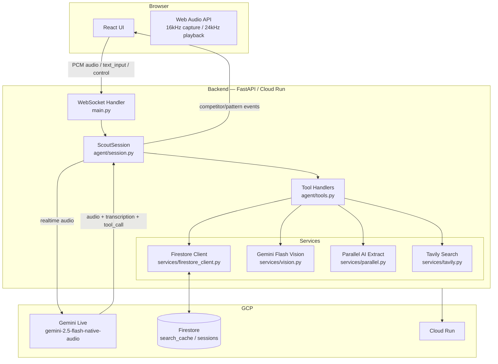
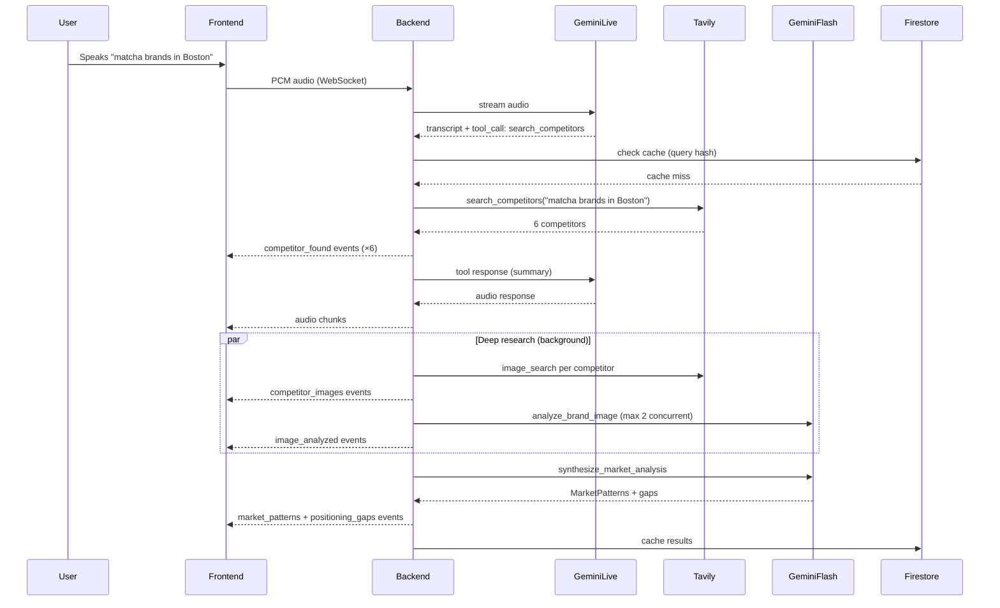

# Scout

**Voice-powered brand competitive intelligence — powered by Gemini Live**

   

---

## What is Scout

Scout is a voice + text interface that lets founders and marketers research the visual competitive landscape of any market in real time. Speak a query — "matcha brands in Boston" — and Scout discovers competitors, analyzes their visual branding, extracts positioning language, and synthesizes white-space opportunities, all while streaming results live to the UI as each piece of research completes. All insights are grounded in live data — Tavily and Parallel AI act as search agents that retrieve real competitor pages, images, and copy so the model never hallucinates brand facts.

---

## Features

- **Real-time voice conversation** — Gemini Live (voice: Aoede), full duplex audio at 16 kHz capture / 24 kHz playback
- **Automatic competitor discovery** — Tavily search with results cached in Firestore to avoid repeat queries
- **Visual brand analysis** — Gemini Flash vision model analyzes each competitor's brand imagery
- **Text & positioning extraction** — Parallel AI extracts brand copy from competitor pages
- **Market pattern synthesis** — Gemini Flash identifies common themes and white-space gaps across the full competitor set
- **Live streaming UI** — competitor cards and analysis panels populate incrementally as research completes
- **Search refinement loop** — follow-up voice input triggers a new search cycle without restarting the session
- **Grounded outputs** — every insight is backed by live search results from Tavily (web + image) and Parallel AI (page extraction); no hallucinated brand facts

---

## Architecture


### Component diagram



### Request sequence



---

## Tech Stack

| Layer | Technology |
|---|---|
| AI Voice Agent | Gemini Live (`gemini-2.5-flash-native-audio-preview`) |
| Visual Analysis | Gemini Flash (vision) |
| Web Search | Tavily Python SDK |
| Text Extraction | Parallel AI |
| Backend | FastAPI + uvicorn (Python 3.12) |
| Frontend | React 19 + TypeScript + Vite |
| Database | Google Cloud Firestore |
| Deployment | GCP Cloud Run + Cloud Build |

---

## Project Structure

```
MarketResearch/
├── backend/
│   ├── main.py                  # FastAPI app + WebSocket handler
│   ├── models.py                # Pydantic models + WS event types
│   ├── agent/
│   │   ├── session.py           # ScoutSession (Gemini Live ↔ browser)
│   │   ├── tools.py             # Tool handlers + deep research pipeline
│   │   └── prompts.py           # System prompt + tool declarations
│   ├── services/
│   │   ├── tavily.py            # Competitor + image search
│   │   ├── vision.py            # Brand image analysis (Gemini Flash)
│   │   ├── parallel.py          # Brand text extraction (Parallel AI)
│   │   └── firestore_client.py  # Cache + session persistence
│   ├── Dockerfile
│   └── requirements.txt
├── frontend/
│   ├── src/
│   │   ├── App.tsx              # Root layout + resize logic
│   │   ├── hooks/
│   │   │   ├── useWebSocket.ts  # Research state + event handling
│   │   │   └── useAudio.ts      # Mic capture + PCM playback
│   │   └── components/
│   │       ├── VoiceInterface.tsx
│   │       ├── ResearchFeed.tsx
│   │       ├── CompetitorCard.tsx
│   │       ├── MarketPatterns.tsx
│   │       ├── PositioningGaps.tsx
│   │       └── ActivityStream.tsx
│   ├── package.json
│   └── vite.config.ts
├── cloudbuild.yaml              # GCP Cloud Build pipeline
└── README.md
```

---

## Environment Variables

Create `backend/.env` with the following:

| Variable | Required | Description |
|---|---|---|
| `GEMINI_API_KEY` | Yes | Google AI API key (Gemini Live + Flash) |
| `TAVILY_API_KEY` | Yes | Tavily search API key |
| `PARALLEL_API_KEY` | Yes | Parallel AI extraction key |
| `GOOGLE_CLOUD_PROJECT` | Yes | GCP project ID (Firestore) |
| `FIRESTORE_DATABASE` | No | Firestore database ID (default: `(default)`) |

---

## Local Development

```bash
# Backend
cd backend
python -m venv .venv && source .venv/bin/activate
pip install -r requirements.txt
cp .env.example .env   # fill in your keys
uvicorn main:app --reload --port 8000

# Frontend (new terminal)
cd frontend
npm install
npm run dev   # http://localhost:5173
```

Vite proxies `/ws/*` to `localhost:8000` during development — no CORS configuration needed.

---

## GCP Deployment

### One-time setup

```bash
# Authenticate
gcloud auth login
gcloud config set project YOUR_PROJECT_ID

# Enable required APIs
gcloud services enable \
  run.googleapis.com \
  cloudbuild.googleapis.com \
  secretmanager.googleapis.com \
  firestore.googleapis.com

# Store secrets in Secret Manager
echo -n "YOUR_KEY" | gcloud secrets create GEMINI_API_KEY --data-file=-
echo -n "YOUR_KEY" | gcloud secrets create TAVILY_API_KEY --data-file=-
echo -n "YOUR_KEY" | gcloud secrets create PARALLEL_API_KEY --data-file=-

# Grant Cloud Build access to secrets
PROJECT_NUMBER=$(gcloud projects describe $PROJECT_ID --format="value(projectNumber)")
gcloud secrets add-iam-policy-binding GEMINI_API_KEY \
  --member="serviceAccount:$PROJECT_NUMBER@cloudbuild.gserviceaccount.com" \
  --role="roles/secretmanager.secretAccessor"
# Repeat for TAVILY_API_KEY and PARALLEL_API_KEY
```

### Deploy

```bash
gcloud builds submit --region=us-east1
```

Cloud Build runs `cloudbuild.yaml` which:
1. Builds the React frontend (`npm ci && npm run build`) and copies the output into `backend/static/`
2. Builds and pushes a Docker image tagged with the commit SHA
3. Deploys to Cloud Run (`us-east1`) with secrets injected and a 3600 s request timeout

The deployed service URL is printed at the end of the build log.
